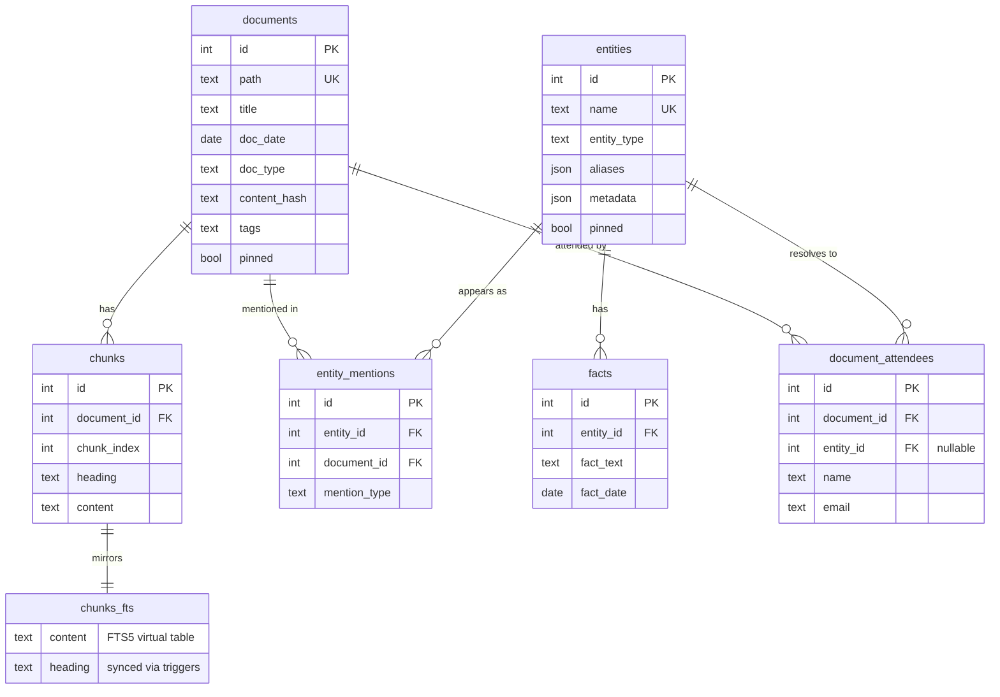
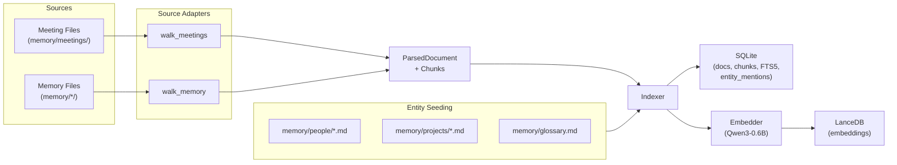
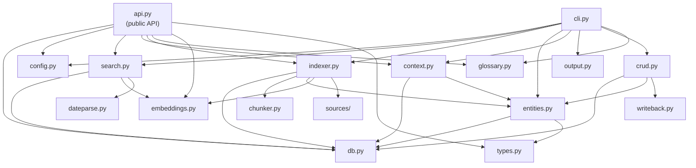

# kb Architecture

## Overview

`kb` is a local knowledge base for your workspace. It provides semantic + keyword search over meeting notes, transcripts, and memory files. Designed as the foundation for a personal digital twin.

## Storage Layer

Two storage engines, co-located in the data directory (default `~/.config/kbx/`):

### SQLite (`metadata.db`)

- **WAL mode** for concurrent reads during writes
- **`documents`** — one row per source file (path, title, date, type, content_hash, tags)
- **`chunks`** — one row per chunk (content, heading, document FK)
- **`chunks_fts`** — FTS5 virtual table (Porter stemmer + Unicode tokenizer), synced via INSERT/DELETE triggers
- **`entities`** — seeded from memory files (name, type, aliases as JSON)
- **`entity_mentions`** — links entities to documents (tagged/participant/discussed)

### LanceDB (`vectors/`)

- Serverless, file-based vector database
- **`chunks` table** — one row per chunk: `chunk_id`, `embedding` (float32[1024]), `doc_type`, `doc_date`, `tags`, `document_id`, `entity_ids`
- Supports metadata filtering during vector search

### Entity-Relationship Diagram



The **LanceDB `chunks` table** mirrors SQLite chunk IDs with added vector data: `chunk_id`, `embedding` (float32[1024]), `doc_type`, `doc_date`, `tags`, `document_id`, `entity_ids`.

## Embedding Model

**Qwen3-Embedding-0.6B** (Qwen/Qwen3-Embedding-0.6B)

| Property | Value |
|----------|-------|
| Parameters | 600M |
| Dimensions | 1024 |
| Max context | 32K tokens |
| MTEB English | 70.70 |
| Instruction-aware | Yes (via `prompt=` param) |

Instructions used:
- **Indexing**: `"Represent this document section for retrieval"`
- **Querying**: `"Find meeting notes, transcripts, and documents relevant to this query"`

### Safety Limits

- `MAX_TEXT_CHARS = 8000` (~2000 tokens) — truncation cap to prevent MPS OOM
- `EMBED_BATCH = 16` — texts per embedding batch
- MPS watermark: 50% high / 30% low (prevents GPU memory exhaustion on macOS)

Model cached at `~/.config/kbx/model/` (~1.1GB).

## Source Adapters

Pluggable adapters in `kb/sources/`:

### `meetings.py`

Walks `memory/meetings/YYYY/MM/DD/*.md`. Processes files with `.notes.md` and `.transcript.md` suffixes. Parses YAML frontmatter for title, date, type, granola_id, tags.

### `memory.py`

Walks `memory/` subdirectories:
- `memory/people/*.md` → `memory_person` (single chunk per file)
- `memory/projects/*.md` → `memory_project` (single chunk per file)
- `memory/context/*.md` → `memory_context` (single chunk per file)
- `memory/glossary.md` → `memory_glossary` (one chunk per table row)

## Data Flow



## Public Python API

`api.py` exposes a `KnowledgeBase` service class — the single entry point for external consumers (e.g. brief-deck, FastAPI apps). Owns DB + config + embedder lifecycle.

```python
from kb import KnowledgeBase

with KnowledgeBase(thread_safe=True) as kb:
    results = kb.search("cloud migration")
    people = kb.list_entities(entity_type="person")
```

- **`thread_safe=True`** — opens connection with `check_same_thread=False` + WAL + `busy_timeout`
- **Embedder lifecycle** — lazy-loaded on first `search()`/`index()`, shared across both, GPU memory released on `close()`
- **Auto-staleness** — changed memory files auto-reindexed before search/context
- All methods return Pydantic models (see `types.py`)

Design doc: `docs/plans/2026-02-24-python-api-design.md`

## File Structure

```
src/kb/
├── __init__.py        # Re-exports KnowledgeBase
├── __main__.py        # Entry point (`python -m kb`)
├── api.py             # KnowledgeBase service class (public Python API)
├── cli.py             # Click CLI — all user-facing commands
├── config.py          # Paths, constants, configuration
├── types.py           # Pydantic strict models (ParsedDocument, Chunk, API types, etc.)
├── db.py              # SQLite + LanceDB management
├── indexer.py          # Orchestrates indexing pipeline
├── search.py          # Hybrid search (FTS + vector + reranking)
├── embeddings.py      # Qwen3-Embedding-0.6B wrapper
├── entities.py        # Entity seeding + linking + resolution
├── chunker.py         # Markdown-aware chunking
├── context.py         # `kb context` — compact workspace orientation
├── output.py          # Output formatting (json/table/csv/jsonl)
├── crud.py            # Memory CRUD (notes, pins, facts)
├── writeback.py       # Write-back to memory files on disk
├── staleness.py       # Detect stale index entries
├── glossary.py        # Glossary term management
├── dateparse.py       # Natural-language date extraction for search
├── mcp_server.py      # MCP server interface
├── sources/
│   ├── __init__.py
│   ├── meetings.py    # Meeting notes + transcripts walker
│   └── memory.py      # Memory files walker
└── sync/
    ├── __init__.py
    └── granola.py     # Granola API sync: client, transform, write
```

Supporting directories (at repo root):

```
kb/
├── docs/              # This documentation
├── data/              # gitignored — SQLite DB, LanceDB vectors, model cache
└── tests/             # Test suite
```

## Module Dependency Graph


