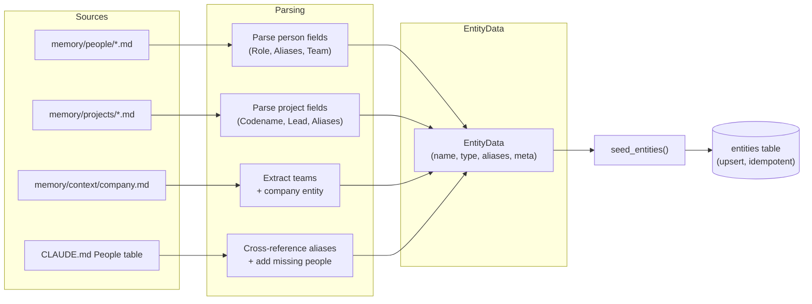
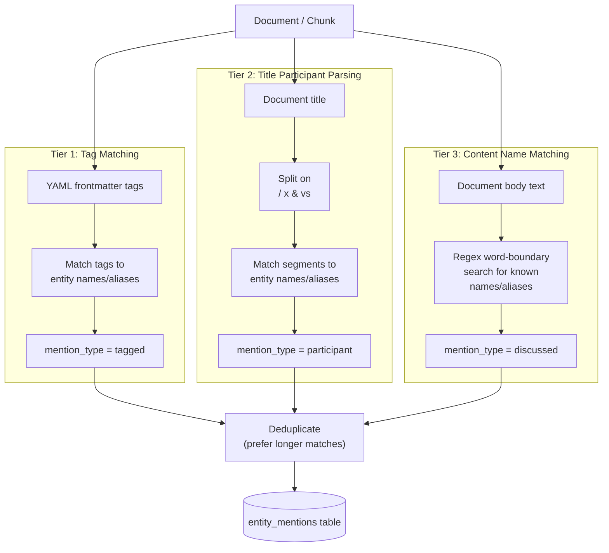

# Entity System

## Overview

Entities represent people, projects, teams, and companies in the knowledge base. They enable queries like "everything about Linnea" or "meetings where Rust migration was discussed".

## Entity Sources

Seeded from four sources (in order):

1. **`memory/people/*.md`** (25 people) — parsed from markdown fields (`**Role:**`, `**Also known as:**`, etc.)
2. **`memory/projects/*.md`** (12 projects) — parsed from markdown fields (`**Codename/Also called:**`, `**Lead:**`, etc.)
3. **`memory/context/company.md`** — Company entity + teams extracted from "Teams" section
4. **`CLAUDE.md` People table** — cross-references existing entities for aliases, adds people not in memory/people/

Total: ~62 entities.

## Entity Types

- `person` — people (employees, contacts)
- `project` — projects and initiatives
- `team` — Linear teams
- `company` — your organization

## Aliases

Each entity can have multiple aliases. For people: full name, first name, file stem, CLAUDE.md short name (e.g. "Kit M." → "Kit Martin").

## Entity Linking

Three-tier matching against document metadata and content:

1. **Tag matching** (`mention_type = "tagged"`) — YAML frontmatter tags matched to entity names/aliases
2. **Title participant parsing** (`mention_type = "participant"`) — title split on ` / `, ` x `, ` & `, ` vs ` separators
3. **Content name matching** (`mention_type = "discussed"`) — regex word-boundary search for known names/aliases

### Disambiguation

- Longer alias matches are preferred (e.g. "Kit Martin" matches before "Kit")
- Ambiguous short names (e.g. "Kit") match all possible entities
- File-stem aliases with hyphens (e.g. "dave-martin") are excluded from content matching

## Idempotency

`seed_entities()` clears and re-seeds on every `index_all()` call. Entity IDs may change between full re-indexes; entity_mentions are also cleared.

## Testing

19 tests in `test_entities.py` covering:
- Person/project file parsing
- Team extraction from company.md
- Tag/title/content matching
- Name disambiguation
- Full seeding with correct counts
- Idempotency
