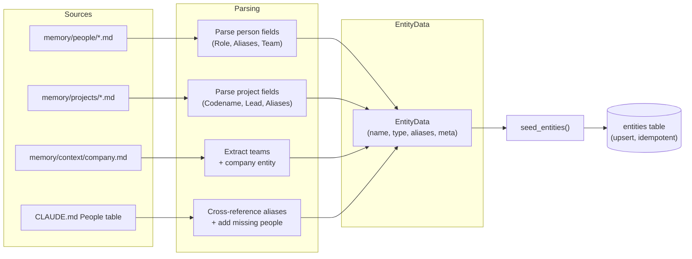
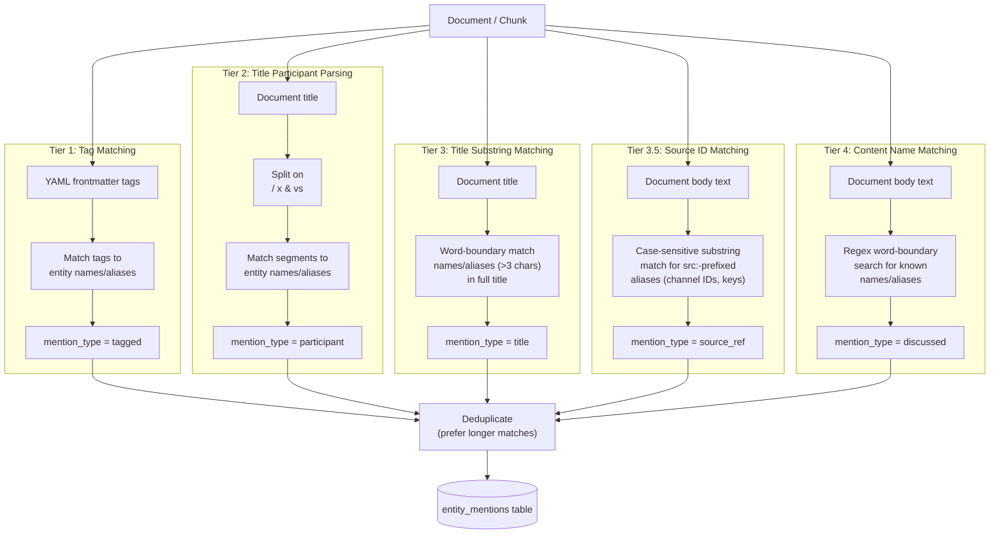

# Entity System

## Overview

Entities represent people, projects, teams, and companies in the knowledge base. They enable queries like "everything about Linnea" or "meetings where Helix refactor was discussed".

## Entity Sources

Seeded from four sources (in order):

1. **`memory/people/*.md`** — parsed from markdown fields (`**Role:**`, `**Also known as:**`, etc.)
2. **`memory/projects/*.md`** — parsed from markdown fields (`**Codename/Also called:**`, `**Lead:**`, etc.). Projects may have a `sources:` list in YAML frontmatter linking to external systems (Slack channels, Linear projects, etc.)
3. **`memory/context/company.md`** — Company entity + teams extracted from "Teams" section
4. **`CLAUDE.md` People table** — cross-references existing entities for aliases, adds people not in memory/people/

Run `kbx index status --json` to see current entity counts.

## Entity Types

- `person` — people (employees, contacts)
- `project` — projects and initiatives
- `team` — Linear teams
- `company` — your organization

## Aliases

Each entity can have multiple aliases. For people: full name, first name, file stem, CLAUDE.md short name (e.g. "Kit M." → "Kit Martin").

For projects with `sources:` in their YAML frontmatter, source IDs (`id`, `key`, `channel` values) are automatically added as `src:`-prefixed aliases during seeding (e.g. `src:C08HJC8MWQN`). These are used for entity linking but filtered from display output.

## Entity Linking

Five-tier matching against document metadata and content:

1. **Tag matching** (`mention_type = "tagged"`) — YAML frontmatter tags matched to entity names/aliases
2. **Title participant parsing** (`mention_type = "participant"`) — title split on ` / `, ` x `, ` & `, ` vs ` separators
3. **Title substring matching** (`mention_type = "title"`) — word-boundary match of entity names/aliases (>3 chars) anywhere in the document title. Catches meetings named after people (e.g. "Anders Sync Notes", "Wren 1:1")
3.5. **Source ID matching** (`mention_type = "source_ref"`) — case-sensitive substring match for `src:`-prefixed aliases (Slack channel IDs, Linear project keys, etc.) in document content. Unambiguous — IDs don't collide with natural language.
4. **Content name matching** (`mention_type = "discussed"`) — regex word-boundary search for known names/aliases

### Disambiguation

- Longer alias matches are preferred (e.g. "Kit Martin" matches before "Kit")
- Very short single names (<=3 chars, e.g. "Ed", "Jo") are skipped for content and title matching (still matched via tags)
- Single names 4+ chars (e.g. "Anders", "Wren") are matched in both content and title
- File-stem aliases with hyphens (e.g. "dave-martin") are excluded from content matching

## Idempotency

`seed_entities()` clears and re-seeds on every `index_all()` call. Entity IDs may change between full re-indexes; entity_mentions are also cleared.

## Testing

Tests in `test_entities.py` cover: person/project file parsing, team extraction from company.md, tag/title/content matching, name disambiguation, full seeding with correct counts, and idempotency. Run with `uv run pytest tests/test_entities.py -v`.
