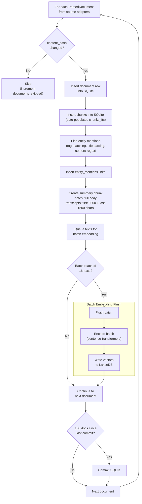

# Indexing

## Overview

The indexer (`kb/indexer.py`) orchestrates the full pipeline: walk sources → chunk → embed → store in SQLite + LanceDB → link entities.

## Modes

- **Full** (`full=True`): Clears all data and re-indexes everything. Used when changing embedding model or schema.
- **Incremental** (default): Skips documents whose `content_hash` hasn't changed. Re-indexes modified documents by deleting old data first.

## Pipeline Steps

For each document:

1. **Insert document** row into SQLite `documents` table
2. **Insert chunks** into SQLite `chunks` table (triggers auto-populate `chunks_fts`)
3. **Link entities** — find mentions via tag/title/content matching, insert into `entity_mentions`
4. **Create summary chunk** — document-level embedding (notes: full body, transcripts: first+last)
5. **Queue texts** for batch embedding
6. **Flush embedding batch** when `EMBED_BATCH` (16) texts accumulated
7. **Write vectors** to LanceDB `chunks` table

Periodic commits: SQLite every 100 docs, LanceDB every 1000 vectors.

## Batch Embedding

Texts are accumulated across documents and embedded in batches of 16 for throughput. The embedder uses `batch_size=32` internally (sentence-transformers parameter) with `MAX_TEXT_CHARS=8000` truncation.

## Summary Embeddings

One additional chunk per document with `heading = "__document__"`:
- **Notes**: Embed full `raw_body` (typically < 1000 tokens)
- **Transcripts**: First 3000 chars + "..." + last 1500 chars
- **Memory files**: Skipped (already single-chunk)

Summary prefix includes entity info: `[Summary: Title | Date: ... | Entities: ...]`

## Error Handling

Per-document try/except. Errors are collected in `IndexResult.errors` without stopping the run.

## Statistics

`IndexResult` tracks:
- `documents_indexed` — successfully processed
- `documents_skipped` — unchanged (incremental mode)
- `chunks_created` — total chunks including summaries
- `entities_linked` — total entity-document links
- `errors` — list of error messages

## Performance Notes

- Full index of ~3000 documents takes ~50 minutes on CPU
- MPS (Apple Silicon GPU) is faster but requires careful memory management
- MPS watermark set to 50% high / 30% low to prevent system lockup
- `EMBED_BATCH = 16` keeps memory usage reasonable
