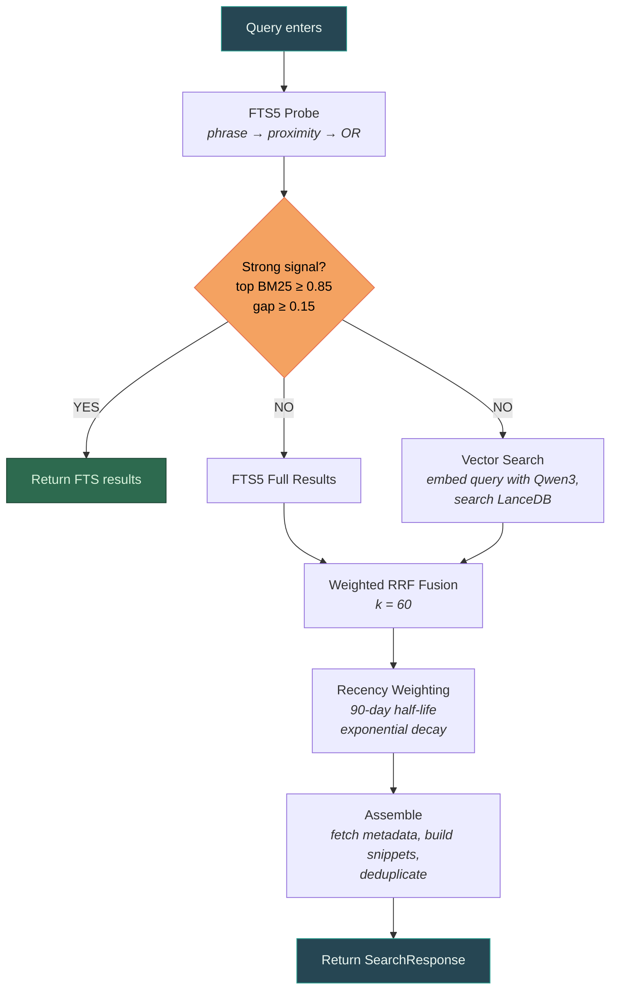

# Search Pipeline

## Overview

`kb/search.py` implements a hybrid search engine combining FTS5 keyword search with LanceDB vector search, fused via Weighted Reciprocal Rank Fusion (RRF) with recency weighting.

## Pipeline



## Components

### BM25 Score Normalization

FTS5 `bm25()` returns negative scores (more negative = more relevant). These are normalized to [0,1] using min-max normalization: most negative (best match) → 1.0, least negative (worst match) → 0.0. Single results get score 1.0.

Column weights: `bm25(chunks_fts, 1.0, 2.0)` — heading matches get 2x boost over content matches.

### FTS5 Phrase + Proximity Search

Multi-word queries try four match levels, merging results across all variants:

1. **Phrase**: `"rust migration"` — exact phrase match
2. **Proximity**: `NEAR(rust migration, 10)` — words within 10 tokens
3. **AND** (implicit): `rust migration` — all terms must appear in the row
4. **OR fallback**: `rust OR migration` — either word

Single-word queries use the term directly. Prefix matching is supported via trailing `*` (e.g. `migr*`).

### Strong Signal Fast Path

If FTS5's top result has normalized BM25 ≥ 0.85 with ≥ 0.15 gap to second, vector search is skipped. Most specific queries ("MFA implementation") are handled perfectly by FTS5 alone.

### Weighted RRF Fusion

Combines FTS and vector result lists:

```python
rrf_score = 1 / (k + rank)  # k=60
```

- Both FTS and vector lists get **2x weight**
- Top-rank bonus: **+0.05** for rank 1, **+0.02** for ranks 2-3
- Results appearing in both lists naturally score higher

### Recency-Weighted Scoring

Exponential decay with 90-day half-life:

```
final = (1 - weight) * score + weight * recency_factor * score
```

- Default weight: 0.15
- `--recency 0.3` for heavier bias
- `--recency 0` for pure similarity
- `None` dates get neutral weight (0.5)

### FTS-Only Fallback

If LanceDB has no vectors (e.g. model not downloaded, index not built), search works with FTS only and prints a warning to stderr. Users can search immediately while embeddings compute.

## Public API

```python
search(
    db: Database,
    embedder: Embedder | None,
    query: str,
    *,
    limit: int = 10,
    fast: bool = False,       # FTS only, ~instant
    recency: float = 0.15,    # recency weight
    doc_type: str | None = None,  # filter
    hook: SearchProgressHook | None = None,
) -> dict
```

### Result Structure

```json
{
  "results": [
    {
      "chunk_id": 42,
      "document_id": 7,
      "title": "Wren / Soren",
      "path": "memory/meetings/2026/01/27/...",
      "date": "2026-01-27",
      "doc_type": "notes",
      "score": 0.94,
      "section": "Performance Review",
      "snippet": "Soren received needs improvement rating...",
      "entities": ["Soren Chen", "Wren Kasper"]
    }
  ],
  "meta": {
    "query": "performance review Soren",
    "total": 12,
    "limit": 10,
    "execution_ms": 67
  }
}
```

## Search Modes

| Mode | Flag | Speed | Method |
|------|------|-------|--------|
| Fast | `--fast` | ~instant | FTS5 only |
| Default | (none) | ~2s | Hybrid FTS5 + vector + RRF |
| Deep | `--deep` | ~10s | Hybrid + reranking (future Phase 9+) |

## Progress Hooks

`SearchProgressHook` base class with overridable methods:

- `on_fts_start()` / `on_fts_done(count)`
- `on_vector_start()` / `on_vector_done(count)`
- `on_fusion_done(count)`

Default is no-op. CLI can pass a spinner, tests can assert stages.

## Testing

29 tests in `test_search.py`:
- BM25 normalization (5 tests)
- RRF scoring (2 tests)
- Recency weighting (4 tests)
- Snippet extraction (4 tests)
- Progress hooks (2 tests)
- FTS integration (7 tests)
- FTS-only fallback (2 tests)
- Recency in search (2 tests)
- Hook integration (1 test)
