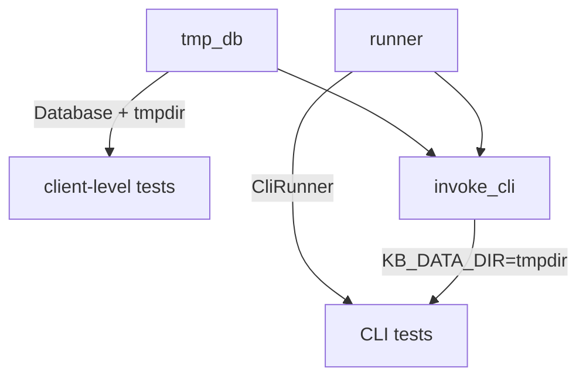

# Testing Guide

## Running Tests

```bash
uv run pytest -x -q              # fast: fail on first error
uv run pytest --cov              # with coverage report
uv run pytest -k "test_name"     # run specific test
uv run pytest -m "not slow"      # skip ML model tests (default)
```

No network or API keys needed — all tests use mocked data.

## Test File Map

| File | Focus |
|------|-------|
| `test_api.py` | KnowledgeBase public API: lifecycle, entities, documents, memory, search, context, index |
| `test_cli.py` | CLI commands: search, view, list, entity, index, usage, notes, pin |
| `test_search.py` | Search pipeline: BM25, RRF, recency, filtering, hooks |
| `test_indexing.py` | Indexing: seed, chunk, embed batch, incremental vs full |
| `test_entities.py` | Entity seeding, fuzzy matching, mention detection |
| `test_context.py` | Context generation: pinned docs, entity ranking, filtering |
| `test_embeddings.py` | Embedding backends: PyTorch, MLX, batch processing, truncation |
| `test_sync_granola.py` | Granola sync: API mocking, dedup, attendee matching |
| `test_mcp.py` | MCP server: resources, tools, error handling |
| `test_writeback.py` | DB-to-file sync: header rebuild, preserve body, atomic writes |
| `test_crud.py` | Entity CRUD: create, edit, delete with file sync |
| `test_output.py` | Formatting: json, csv, jq, field selection |
| `test_integration.py` | End-to-end: full index + search flows |
| `test_smoke.py` | Quick sanity: db init, entity crud, basic index |
| `test_properties.py` | Hypothesis property-based tests |
| `test_dateparse.py` | Natural date parsing edge cases |
| `test_types.py` | Pydantic model validation, API response types |
| `test_staleness.py` | Stale file detection + auto-reindex |
| `test_glossary.py` | Glossary CRUD |
| `test_db_extras.py` | Database edge cases, migrations |
| `test_coverage_extras.py` | Coverage gap fillers |

## Fixtures (`conftest.py`)

Three core fixtures compose the test infrastructure:



| Fixture | Type | Purpose |
|---------|------|---------|
| `tmp_db` | `(Database, Path)` | Temporary SQLite + LanceDB in a `TemporaryDirectory`. Yields `(db, path)` |
| `runner` | `CliRunner` | Click CLI test runner |
| `invoke_cli` | helper | Sets `KB_DATA_DIR` env var to isolate tests from real data |

## Adding a CLI Test

```python
def test_my_command(self, runner, tmp_db):
    db, db_path = tmp_db
    # ... seed test data into db ...
    result = invoke_cli(runner, ["my-command", "--json"], db_path)
    assert result.exit_code == 0
    data = json.loads(result.output)
    # assert on data...
```

## Adding an Indexer Test

```python
def test_my_indexing(self, tmp_db):
    db, db_path = tmp_db
    # create test markdown files in db_path / "memory/people/" etc.
    result = index_all(db, embedder=None, project_root=db_path)
    assert result.documents_indexed > 0
```

## Markers

- `@pytest.mark.slow` — loads real ML models (~1.1GB). Skipped by default. Run with `uv run pytest -m slow`.

## Coverage

Coverage minimum is 90%, enforced by pre-commit (`--cov-fail-under=90`).

```bash
uv run pytest --cov --cov-report=term-missing    # see uncovered lines
```

Coverage exclusions (configured in `pyproject.toml`):
- `pragma: no cover` — for entrypoints like `__main__.py`
- `if TYPE_CHECKING:` — import-only blocks

When adding new features, check that new code paths have tests — especially error handling and edge cases in search ranking or entity resolution.
